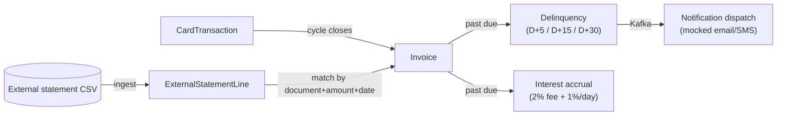

# card-billing-legacy

[](https://github.com/leon-lourenco/card-billing-legacy/actions/workflows/ci.yml)

**Case study:** [leon-lourenco.github.io/card-billing-legacy](https://leon-lourenco.github.io/card-billing-legacy/) — the domain, the deliberate anti-patterns, and a real bug this project caught on its own first live run.

A card issuer's billing and collections cycle, built the way a real one usually looks after a
decade of organic growth: one deployable, one shared database, Java 11 and Spring Boot 2.7 -
already split into modules, not yet split into services. This is the "before" half of a
two-part portfolio piece; a modernized counterpart, architected from this repo's actual seams
rather than a textbook diagram, is the next phase.

This is a portfolio project by [Leonardo Lourenço Gomes](https://www.linkedin.com/in/leonardo-lourenço-gomes),
a senior backend engineer, built in public in scoped phases. Everything runs locally via
`docker compose up` - Postgres and Redpanda, no hosted demo, no infrastructure billed by the
hour.

## Status

- [x] **Domain**: a card issuer's billing cycle - customers, accounts, cards, transactions,
      invoices, payments, plus the audit trail each batch job needs.
- [x] **Four batch jobs**: invoice closing, delinquency detection with staged notification
      (D+5/D+15/D+30), interest/late-fee accrual, and external statement reconciliation.
- [x] **Kafka-based notification dispatch** (Redpanda), mocked delivery with a real history
      table - no Twilio/SendGrid account, no cost.
- [x] **REST trigger + Swagger** for every job, alongside its own daily `@Scheduled` run.
- [x] **Verified against a live run**: 150 seeded customers, 2,738 transactions, 28 invoices
      closed, 21 notified and escalated, 42 Kafka notification events, 1 reconciliation match -
      real numbers from an actual `docker compose up` run, not fixtures. See
      [Verified against a live run](#verified-against-a-live-run) below, including a real bug
      this project's own evidence run caught.

## The domain

A credit card billing cycle, the same shape most issuers run: a `CardTransaction` happens, gets
aggregated into an `Invoice` when its billing cycle closes, and from there either gets paid or
goes delinquent - in which case interest accrues and notification escalates, until an external
statement eventually reconciles a payment against it.



## Modular monolith architecture

Seven Maven modules, one deployable, one shared Postgres database - the middle stage a lot of
real systems sit in for years: already organized, not yet physically split.

```
card-billing-legacy/
├── domain/                 shared JPA entities and repositories - every other module depends on this
├── invoice-closing/        aggregates a cycle's transactions into a new invoice
├── delinquency/             detects overdue invoices, escalates notification (D+5/D+15/D+30)
├── interest-accrual/       applies the late fee and daily interest, idempotently
├── notification-dispatch/  Kafka publisher + consumer, mocked delivery, real history table
├── reconciliation/          CSV ingest + the O(n²) legacy matcher
└── api/                     the runnable Spring Boot app - wires everything, exposes /jobs/*, seeds data
```

`api` is the only module with a main class; every other module is a plain library jar. Nothing
here is split into separate deployables - that's deliberately the modern counterpart's job, not
this repo's.

## Design decisions

### Java 11 and Spring Boot 2.7 - the last release before the jump

Every other repo in this portfolio runs current Java and Spring Boot. This one doesn't, on
purpose: Java 11 and Spring Boot 2.7.18 (the final release of the 2.x line) is the version pair
a lot of real enterprise systems are still sitting on, not because anyone chose it recently but
because nobody has migrated yet. `spring.jpa.hibernate.ddl-auto: update` owns the schema here
too, instead of Flyway/Liquibase - another thing a system in this state typically hasn't
adopted yet. Both are exactly what the eventual modernization phase gets to fix.

### Matching by document + amount + date, not by a shared ID

The reconciliation matcher in
[`ReconciliationMatchJob`](reconciliation/src/main/java/com/cardbilling/reconciliation/ReconciliationMatchJob.java)
is a nested loop over every unmatched statement line against every open invoice - O(lines ×
invoices). That's not an accident of laziness: an external bank statement and this system's own
invoices were never going to share a database ID, so there's no index to hit. A match is decided
by customer document number, amount, and a statement date within 3 days of the invoice's due
date - exactly the kind of fuzzy, non-indexed criteria that turns into a nested loop in real
legacy code, because there was never a clean key to look it up by in the first place.

### Notification delivery has no delivery guarantee - on purpose

[`NotificationRequestPublisher`](notification-dispatch/src/main/java/com/cardbilling/notification/NotificationRequestPublisher.java)
writes a `Notification` row, then publishes to Kafka - not inside the same transaction, not
using the outbox pattern `pix-payment-gateway` uses for exactly this reason. If the publish is
lost, the row just sits there in `REQUESTED` forever. This is deliberate: the point of this repo
is showing what the legacy version gets wrong, and this project's own first live run produced a
real instance of it without being asked to - see below.

## Verified against a live run

Real output from `docker compose up -d` plus the app run locally against it - not fixtures, not
hand-edited numbers.

| Seeded | Count |
|---|--:|
| Customers / accounts / cards | 150 each |
| Card transactions (4 months of history) | 2,738 |

| Job run | Result |
|---|--:|
| Invoice closing (3 historical cycles) | 21 invoices closed |
| Delinquency detection | 21 invoices notified and escalated |
| Interest accrual | 21 invoices accrued (2% fee + 1%/day) |
| Notification requests (2 channels × 21) | 42 |
| Reconciliation (1 statement line, matched by document+amount+date) | 1/1 matched |

### A real bug this run caught

`NotificationDeliveryConsumer` originally loaded a `Notification` via `findById` with no
transaction, then read its lazily-loaded `customer` association to build the mock delivery
message. On the very first live run against Kafka, every single message failed with
`LazyInitializationException: could not initialize proxy [Customer] - no Session` - correct
Hibernate behavior; the session backing that proxy had already closed by the time the log line
tried to read it. The fix is one `@Transactional` on the listener method, keeping the session
open through the whole handler.

### An anti-pattern this run also caught, unplanned

After that fix, only 30 of the 42 notification requests actually reached
`NotificationDeliveryConsumer` - the other 12 are still sitting in `REQUESTED`, permanently.
They were published *before* a separate Redpanda configuration fix (the broker was
advertising an address unreachable from the host), while `KafkaTemplate.send()` was silently
failing in the background - the publisher never checks that the send actually landed. This is
exactly the gap called out in `NotificationRequestPublisher`'s own comment, caught live and
unprompted rather than described in the abstract. Nothing here has been patched over: those 12
rows are still `REQUESTED` in the seeded database today, and fixing that gap - real
delivery guarantees, not a hopeful `.send()` - is exactly the kind of thing the modernized
counterpart exists to do properly.

## The jobs

| Endpoint | What it does |
|---|---|
| `POST /jobs/invoice-closing/run?date=` | Close every active card's cycle whose cycle day matches the date. |
| `POST /jobs/delinquency/run?date=` | Detect overdue invoices, escalate notification (D+5/D+15/D+30). |
| `POST /jobs/interest-accrual/run?date=` | Apply the late fee and daily interest to overdue invoices. |
| `POST /jobs/reconciliation/ingest` | Upload an external statement CSV. |
| `POST /jobs/reconciliation/match` | Match every unmatched statement line against open invoices. |

Every job also runs on its own nightly `@Scheduled` cron in
[`DailyBatchScheduler`](api/src/main/java/com/cardbilling/scheduling/DailyBatchScheduler.java) -
the endpoints exist so a demo doesn't have to wait for midnight.

## Tech stack

Java 11, Spring Boot 2.7.18, Spring Data JPA (Hibernate), Spring Kafka, PostgreSQL, Redpanda
(Kafka-API-compatible), OpenCSV, springdoc-openapi (Swagger UI), Maven multi-module. Maven
Wrapper is committed, so `./mvnw` works without installing Maven.

## Running it

### Bring up Postgres and Redpanda

```bash
docker compose up -d
```

### Install the reactor, then run the app

```bash
./mvnw install -DskipTests
./mvnw -pl api spring-boot:run
```

The first run seeds 150 customers with four months of transaction history automatically. Swagger
UI is at `http://localhost:8080/swagger-ui.html`.

### Try it

```bash
curl -X POST 'http://localhost:8080/jobs/invoice-closing/run?date=2026-07-20'
curl -X POST 'http://localhost:8080/jobs/delinquency/run?date=2026-08-20'
curl -X POST 'http://localhost:8080/jobs/interest-accrual/run?date=2026-08-20'
```

Watch the app's console for `[MOCK EMAIL]` / `[MOCK SMS]` lines as
`NotificationDeliveryConsumer` drains the Kafka topic.

### Tests

```bash
./mvnw test
```
